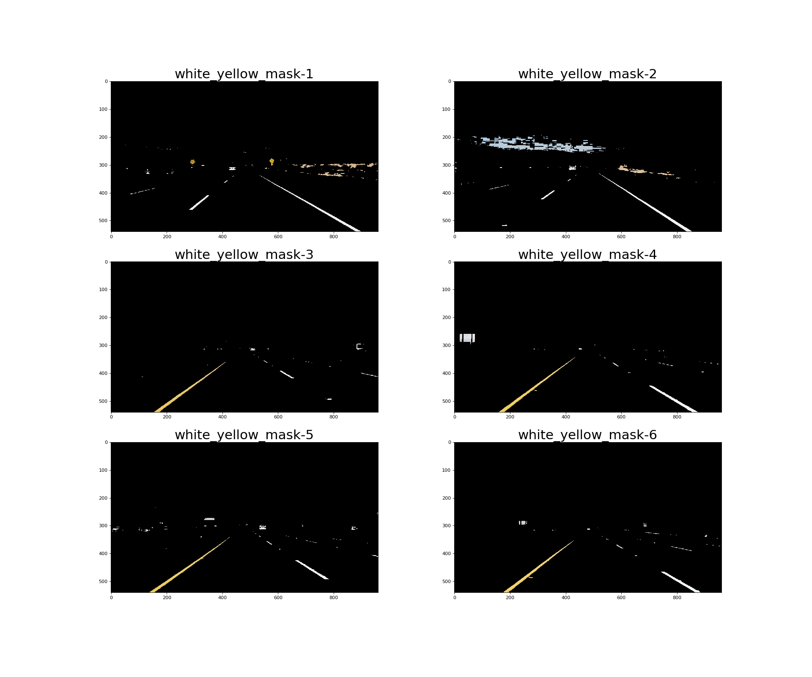
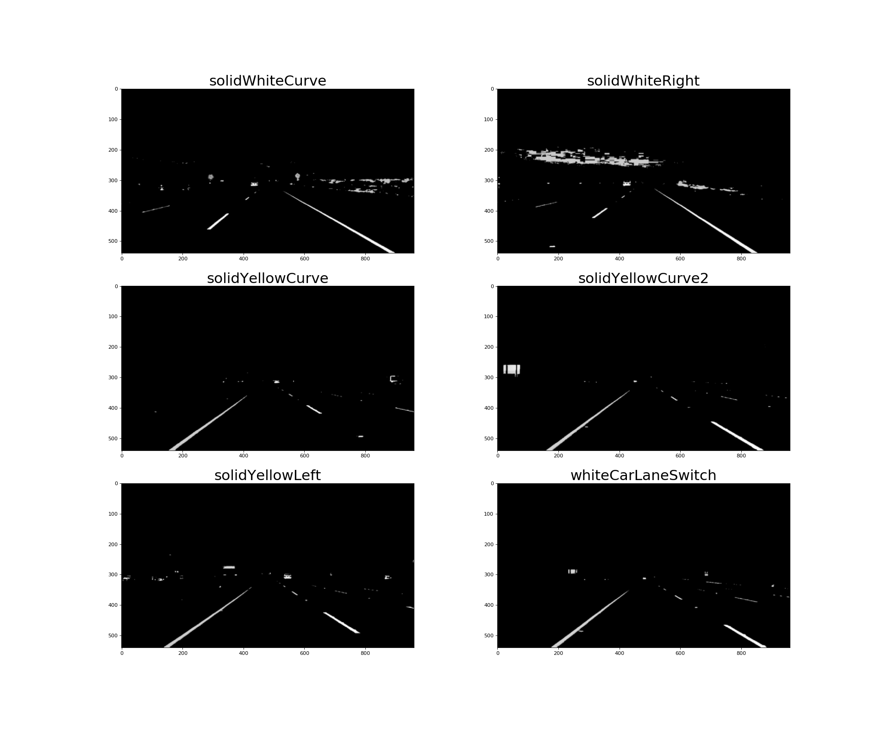
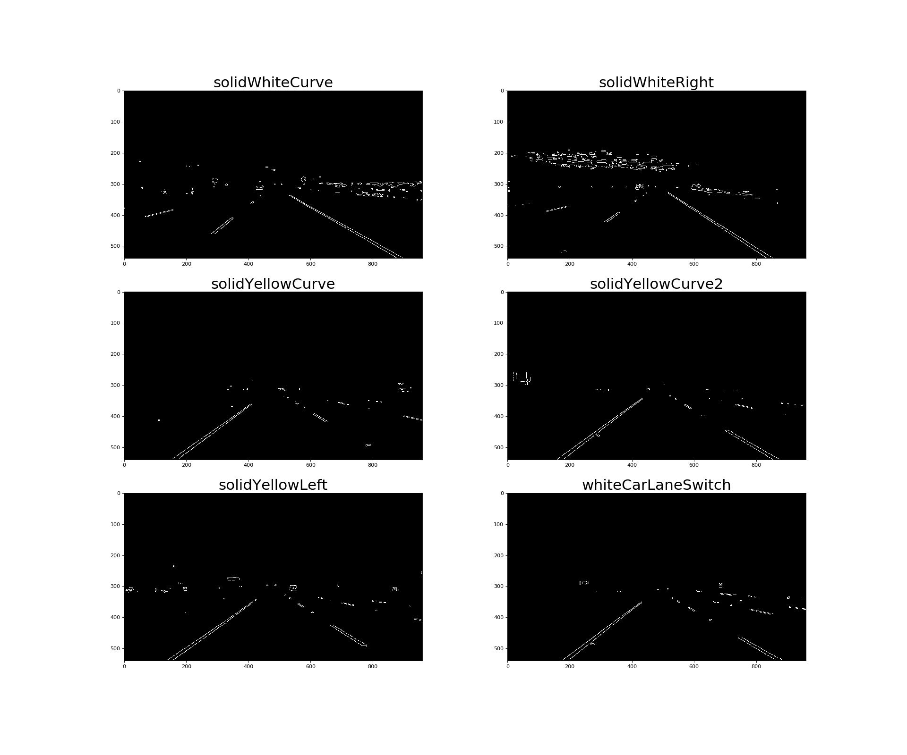
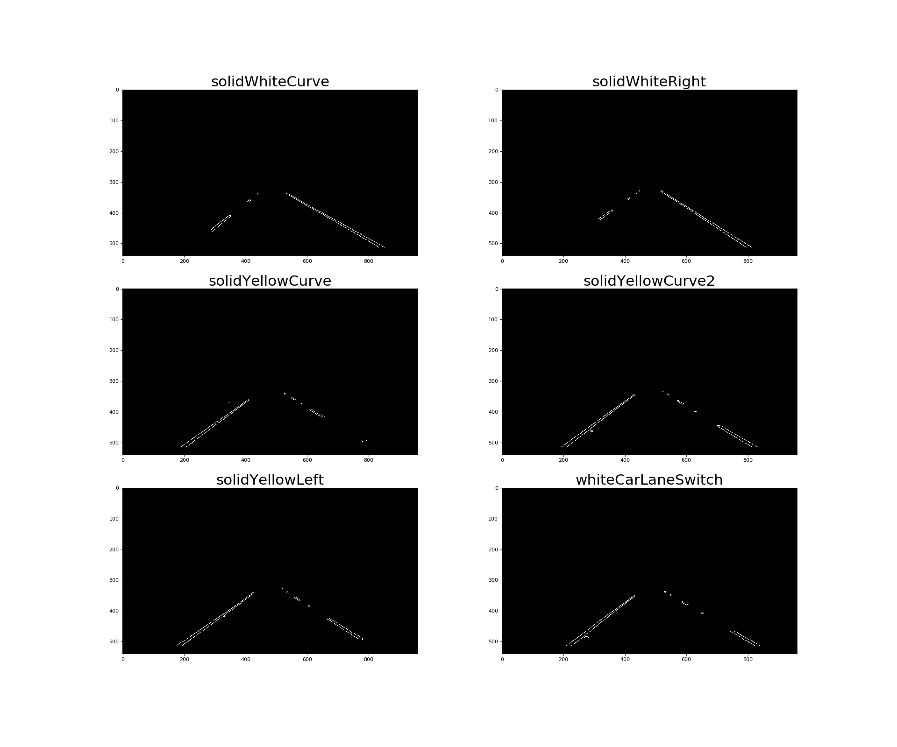
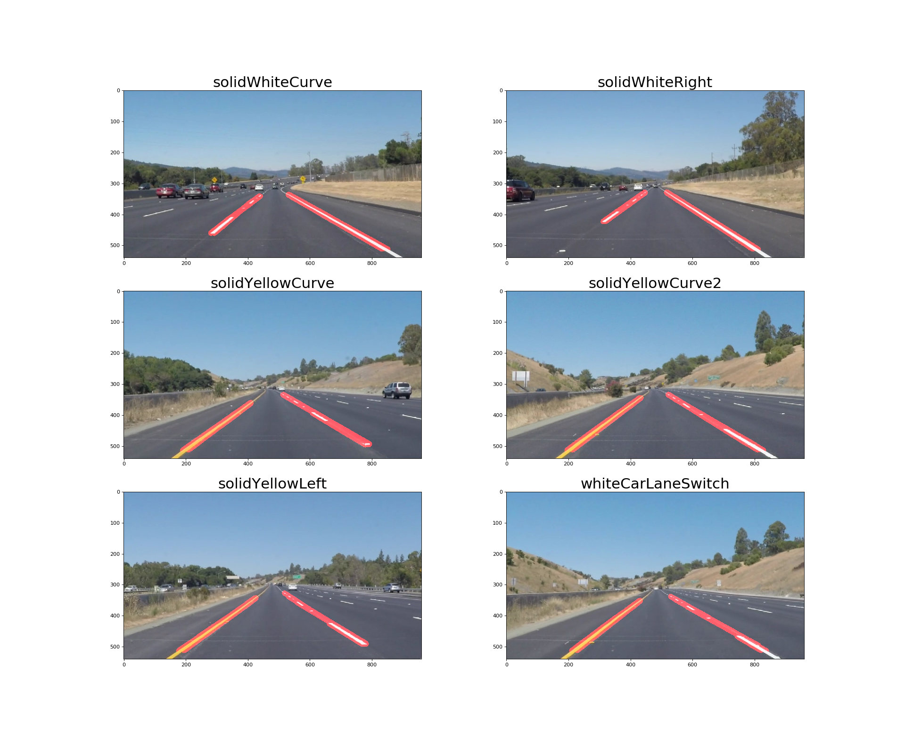
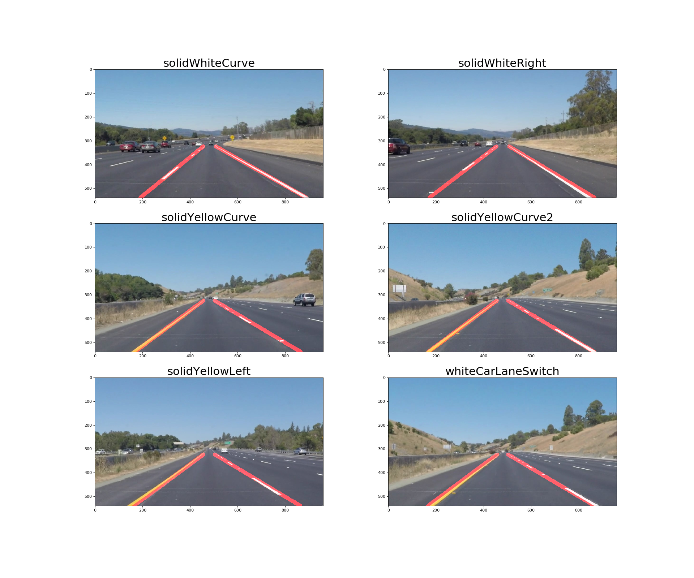

# **Finding Lane Lines on the Road**


## Project Overview

Our eyes plays an important role when we drive, as we use them to decide where to go. The lines on the road that show us where the lanes are act as our constant reference for where to steer the vehicle.  Naturally, one of the first things to do when developing a self-driving car is to automatically detect lane lines using an algorithm.

The aim of this project is to detect lane lines in images using Python and OpenCV.

The code for this project can be found in the file is called Project_1_FindingLaneLines.ipynb and the writeup for the project is contained in the README.md

---

### Finding Lane Lines on the Road

The following pipeline was used to process the image in order to detect the lane lines:
* Color Selection
* Grayscale Conversion
* Gaussian Blur
* Canny Edge Detection
* Region of Interest Selection
* Hough Transform Line Detection
* Averaging & Extrapolating Lines
* Draw Lines

---

### Test Images Before Processing


---

### Image Processing Pipeline

##### 1. Color Selection
As the lane lines in the images come in two colors (yellow, white), the first step of the pipeline involves only selecting the two stated colors and mask the remaining colors in the RGB spectrum out.

One of the factors which would affect this task, is the dark shades which may appear on the road due to shadows produced  on the roads by objects such as tress and bushes.

Therefore, to take precautions the colors were converted from the RGB color space to the HLS color space, which results in the white and yellow color lane lines to be clearly recognized even when there are shadows on the street.

The following functions for the color selection included the following:
* ```cv2.cvtColor(image, cv2.COLOR_RGB2HLS)```
  * To convert the image from the RGB color space to HLS
* ```cv2.inRange()```
  * To filter the white color and the yellow color seperately.
This function returns 255 when the filter conditon is satisfied. Otherwise, it returns 0.
* ```cv2.bitwise_or```
  * To combine yellow and white masks.
The combined mask returns 255 when either white or yellow color is detected.
* ```cv2.bitwise_and```
  * To apply the combined mask onto the original RGB image

The output of this step are as follows:



---

##### 2. Grayscale Conversion

The next the step in the pipeline was to convert the output of the color selection process in the previous step of the pipeline to grayscale for edge detection. This is mainly because the Canny edge detection measures the magnitude of pixel intensity changes or gradients.

The following line of code was used for  gray scaling:

```cv2.cvtColor(image, cv2.COLOR_RGB2GRAY)```

The output images are as follows:


---

##### 3. Gaussian Blur
Edges (lines) cause pixel intensity values to change rapidly (i.e. from 0 to 255) which is what canny edge detection  function identifies. In order to prevent noisy edges to be detected the following function can be used.

Based on the information from Wikipedia
>Gaussian Blur helps smooth out the noise and also smooth the edge, which is considered as the high frequency feature. This in turn will decrease the possibility of failing to detect weak edges by the canny edge detector in the next step of the pipeline.

```cv2.GaussianBlur(image, (kernel_size, kernel_size), 0)```

As this function takes a kernel_size parameter which must be positive and odd. Hence, the values which I tried ranged between 3 to 11 and cross checked the result with the output of the 'canny' function.

Some of the drawbacks faced when using a larger kernel_size value was that the images became more blurry. Therefore the value which worked best was the value 5.

The output images of this step of the pipeline is as follows:



---

##### 4. Canny Edge Detection
According to wikipedia:
> [Canny edge detection](http://docs.opencv.org/trunk/dd/d1a/group__imgproc__feature.html#ga04723e007ed888ddf11d9ba04e2232de) helps in extracting useful structural information from objects in the the image and also dramatically reduce the amount of data needed to be processed.

The code that was used to detect the edges in the images is as follows:

```cv2.Canny(image, low_threshold, high_threshold)```

The high and low threshold value which was selected for this function was based on the recommendation from John F. Canny who stated that the upper:lower ratio should be between 2:1 and 3:1.

These two values were selected by trial and error where I first set the ```low_threshold``` value to 0 and then adjusted the ```high_threshold```, what I identified was that, the lower the value for  ```high_threshold``` the more edges that will be identified.

The value that I had finally selected was ```50``` for  ```low_threshold``` and ```150``` for the ```high_threshold``` value.   

The results of this step of the pipeline is as follows:



---


##### 5. Region of Interest (ROI) Selection

The region of interest for the images in this projects is obviously the road in front of the car. Therefore, it was important to exclude all of the other region which was not the road by applying a mask over it.

This was done by testing various polygons that only included the area of the road in front and excluded the rest of the image.

Once I had identified the optimal set of vertices for the polygon by testing on the test images, the following following line of code was then applied.

```cv2.fillpoly(mask, vertices, color) ```

after which I had applied  ```cv2.bitwise_and(image, mask)```, to mask the region which was outside the region of interest (i.e. the polygon).

The results of this step are as follows:



---

##### 6. Hough Transform Line Detection
This step of the pipeline involves detecting lines from the edges in the images (i.e. the output of the previous step) using [Hough transform](https://en.wikipedia.org/wiki/Hough_transform).

The list of parameters that required tuning are as follows:
* rho: Distance resolution of the accumulator in pixels.
* theta: Angle resolution of the accumulator in radians.
* threshold: Accumulator threshold parameter.
* minLineLength: Minimum line length. Line segments shorter than that are rejected.
* maxLineGap: Maximum allowed gap between points on the same line to link them.

The following line of code returns a list of lines that are detected:

```cv2.HoughLinesP(image, rho, theta, threshold, minLineLength, maxLineGap)```

The output of this step is as follows:



---

##### 7. Averaging & Extrapolating Lines

The output of the function ```cv2.HoughLinesP()``` returns multiple lines, therefore they needed to be averaged and apart from that, the lane lines are also not fully detected and hence the lines needed to extrapolated to cover the full length of the lane lines on either side of the road.

As there are two lane lines, one on the left and the other on the right, hence two slopes and intercepts are required to be identified in order to extrapolate the lines.

Note: The left lane line has a positive slope and the right lane line has a negative slope, however since in the image the y coordinates are reversed (i.e. the y value increases down the y-axis of the image). Therefore the slope of the left lane is negative and the slope of the right lane is positive.


The following function is used to get the average slope intercept:

```
def average_lane_lines(lines):
    left_lane_lines = []
    right_lane_lines = []

    left_lane_line_lengths =[]
    right_lane_line_lengths = []

    for line in lines:
        for x1,y1,x2,y2 in line:
            if x1 == x2:
                continue
            m = (y2 -y1)/(x2 - x1) #calculate gradient
            c = y1 - m*x1 #intercept
            length = np.sqrt((y2-y1)**2 + (x2-x1)**2)

            #This is done as the value of y is in the opposite direction in the image
            if m < 0:
                left_lane_lines.append((m,c))
                left_lane_line_lengths.append((length))
            else:
                right_lane_lines.append((m,c))
                right_lane_line_lengths.append(length)   
    left_lane  = np.dot(left_lane_line_lengths,  left_lane_lines) /np.sum(left_lane_line_lengths)  if len(left_lane_line_lengths) >0 else None  
    right_lane = np.dot(right_lane_line_lengths, right_lane_lines)/np.sum(right_lane_line_lengths) if len(right_lane_line_lengths)>0 else None

    return left_lane, right_lane   
```

##### 8. Draw Lines
In order to draw the lane lines the slope and the intercept returned from the function ```average_lane_lines()``` must be first converted into
pixel points. This in turn is done by the following function:


```
def cvt_line_to_pixels(y1,y2,line):
    """
     Converts (line = (m,c)) Where 'm' is the slope and 'c' is the itercept into pixels
    """    
    if line is None:
        return None    
    m,c = line
    x1 = round_int((y1 - c)/m)
    x2 = round_int((y2 - c)/m)
    y1 = round_int(y1)
    y2 = round_int(y2)    
    return ((x1,y1),(x2,y2))
```

Finally in order to draw the line on the ```initial_img```, the following function is used:

```
def draw_lines(img,initial_img, lines, color=[255, 0, 0], thickness=15):
    img = np.zeros((img.shape[0], img.shape[1], 3), dtype=np.uint8)
    for line in lines:
        if line is not None:
            cv2.line(img,*line, color, thickness)            
    return weighted_img(img,initial_img,1.0,0.95)
```

This function draws `lines` with `color` and `thickness`. Lines are drawn on the image in place.  


The output of this function is as follows:




#### Lane Line Detector class
In order to draw smoother lines I created a class so that the lines are drawn based not only on the current frame but also on the past frames. The number of previous frames is determined by the value of the variable ```self.previous_frames``` in the class.


```
class LaneLinesDetector:
    def __init__(self):
        self.previous_frames=50
        self.left_lane_lines = deque(maxlen=self.previous_frames)
        self.right_lane_lines = deque(maxlen=self.previous_frames)

    def mean_line(self,line,lines):
        if line is not None:
            lines.append(line)

        if len(lines)>0:
            line = np.mean(lines,axis=0,dtype=np.int32)
            line = tuple(map(tuple,line))
        return line

    def pipeline(self,img):
        initial_img = np.copy(img)
        white_yellow_img = select_colour_white_yellow(img)
        gray = grayscale(white_yellow_img)
        blur = gaussian_blur(gray,5)
        edges = canny(blur,50,150)
        roi = select_region_of_interest(edges)
        lines = hough_lines(roi,rho=1, theta=np.pi/180, threshold=20, min_line_len=20, max_line_gap=300)
        left_lane,right_lane = get_lane_lines(roi,lines)

        left_lane_line  = self.mean_line(left_lane,  self.left_lane_lines)
        right_lane_line = self.mean_line(right_lane, self.right_lane_lines)

        return draw_lines(roi,initial_img,(left_lane_line,right_lane_line))

```

### Potential Shortcomings of Current Pipeline

The list of shortcomings for this project are:
1. The pipeline will fail to detect lane lines on curved roads
2. It will also fail to detect lane lines when the slope is steep, both up and down the road.
3. During the night when the lighting conditions are not as good as it is during the day, may also prevent the pipeline from identifying the lane lines accurately.

---


### Improving the Pipeline  

Some of the ways in which the pipeline can be improved are as follows:
1. Using perspective transformation and also poly fitting lane lines rather than fitting to straight lines would help overcome the issue of being unable to detect lane lines on curved roads.
2. Dynamically changing the region of interest rather than having a static region of interest may help solve the problem of detecting lane line on steep roads.
3. For steep roads, the horizontal line can be first detected so that we can tell up to where the lines should extend.

---

### Conclusion
The goal of the project was achieved and the pipeline to detect the lane lines is robust when it come to straight roads on the highway and under good lighting conditions. However, there is a lot more room for improvement in order to make the pipeline more robust.

### Links to Output Result Videos
1. [Solid White Right](https://youtu.be/4ZpFVDB_jSA?list=PLtUiKcyH-5dQhrnOw1SSHK6O5451CQZ6Z)
2. [Solid Yellow Left](https://youtu.be/rDPp7goXN4E?list=PLtUiKcyH-5dQhrnOw1SSHK6O5451CQZ6Z)
3. [Challenge](https://youtu.be/HDaVRaOsPKI?list=PLtUiKcyH-5dQhrnOw1SSHK6O5451CQZ6Z)
